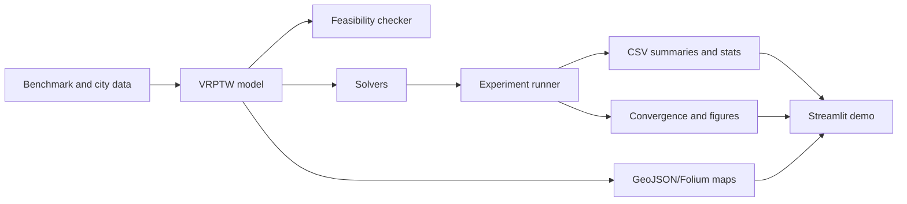

# VRPTW Hybrid Solver

[](https://github.com/Levvvi/vrptw-hybrid-solver/actions/workflows/ci.yml)

Exact validation, ALNS variants, benchmark experiments, and map demos for the
Vehicle Routing Problem with Time Windows.

This portfolio project demonstrates a full engineering chain for VRPTW:
business constraints, mathematical modeling, exact small-instance validation,
heuristic search, adaptive operator selection, benchmark comparison,
statistical review, and interactive route visualization. The emphasis is on
evidence-backed trade-offs rather than claiming a universal best solver.

## What This Project Demonstrates

- VRPTW modeling with capacity, service time, depot return, and hard time
  windows.
- A solution checker that validates customer coverage, capacity, time windows,
  and route timing.
- CP-SAT as a small-scale correctness anchor, not a medium-scale baseline.
- OR-Tools Routing as a strong external baseline.
- Greedy construction and ALNS variants with uniform, roulette, and
  MOSADE-inspired selector logic.
- Reproducible experiment outputs: run CSVs, summaries, statistical tests,
  convergence traces, and figures.
- VIS-01A benchmark route viewer for Solomon/GH x-y coordinates.
- VIS-01B Berlin Mitte city road demo using OSM road geometry and a
  shortest-path travel-time proxy.

## Architecture



## Solver Stack

| Solver | Role | Scope |
| --- | --- | --- |
| `greedy` | Fast construction baseline | Smoke tests, initialization, demos |
| `cp_sat` | Exact validation anchor | Mini and small customer slices only |
| `ortools_routing` | External routing baseline | Strong when it returns a solution |
| `alns_uniform` | ALNS with uniform operator selection | Heuristic baseline |
| `alns_roulette` | ALNS with reward-weighted operator selection | Heuristic baseline |
| `alns_mosade` | ALNS with MOSADE-inspired pair selection | Experimental adaptive selector |

The internal `objective` is vehicle-weighted and should not be read as travel
distance. Public comparisons should report vehicles, distance, runtime, and
feasible rate together.

## Results

All public claims below are mapped to evidence in
[docs/claim_registry.md](docs/claim_registry.md).

### RUN-01 / RUN-02: Small-Scale Pipeline

The small experiment pipeline writes run CSVs, summary CSVs, statistical tests,
solution JSON, convergence CSVs, and figures. CP-SAT is treated as a time-limited
small-instance validation tool; UNKNOWN rows are not counted as feasible or as
optimal.

Evidence:
[docs/P2_RUN_01_REPORT.md](docs/P2_RUN_01_REPORT.md),
[docs/P2_RUN_02_AUDIT.md](docs/P2_RUN_02_AUDIT.md),
[reports/results/summary_small.csv](reports/results/summary_small.csv).

### ABL-01: Selector Ablation

The MOSADE-inspired selector did not outperform uniform or roulette selection in
the exploratory selector ablation.

Evidence:
[docs/P2_ABL_01_REPORT.md](docs/P2_ABL_01_REPORT.md),
[reports/results/ablation_selectors_summary.csv](reports/results/ablation_selectors_summary.csv).

### EXP-02: Medium Benchmark

EXP-02 ran 90 rows: 6 instances x 5 solvers x 3 seeds across Solomon 100 and
Gehring-Homberger 200 selected instances.

| Solver | Feasible rate | Mean vehicles | Mean distance | Mean runtime sec |
| --- | ---: | ---: | ---: | ---: |
| `alns_uniform` | 1.000 | 18.556 | 3076.988 | 40.643 |
| `alns_roulette` | 1.000 | 18.667 | 3056.841 | 40.349 |
| `alns_mosade` | 1.000 | 18.667 | 3067.615 | 40.592 |
| `greedy` | 1.000 | 19.167 | 3530.322 | 28.744 |
| `ortools_routing` | 0.500 | 17.000 | 2403.523 | 60.009 |

OR-Tools Routing found lower-distance solutions where it returned a solution,
but it only reached a 0.5 feasible rate under the fixed 60-second budget. ALNS
variants reached 1.0 feasible rate on this selected medium suite. These are
medium-scale exploratory results, not large-scale production evidence.

Evidence:
[docs/P2_EXP_02_REPORT.md](docs/P2_EXP_02_REPORT.md),
[reports/results/summary_medium.csv](reports/results/summary_medium.csv),
[reports/results/runs_medium.csv](reports/results/runs_medium.csv).

### VIS-01B: Berlin Mitte City Demo

The city demo uses a Berlin Mitte OSM driving network cache, 30 synthetic orders
sampled from graph nodes, network shortest-path distances, and proxy travel
times derived from road lengths and speed assumptions.

| Solver | Feasible | Vehicles | Distance m | Runtime sec |
| --- | --- | ---: | ---: | ---: |
| `greedy` | true | 3 | 32309.954 | 0.200 |
| `ortools_routing` | true | 3 | 22701.994 | 60.010 |
| `alns_roulette` | true | 3 | 23956.684 | 6.214 |
| `alns_mosade` | true | 3 | 23956.684 | 6.256 |

The city demo is a visualization and integration demo. It does not use measured
traffic data.

Evidence:
[docs/P2_VIS_01B_REPORT.md](docs/P2_VIS_01B_REPORT.md),
[reports/demo/city/city_summary.csv](reports/demo/city/city_summary.csv).

## Demo

Install with visualization extras:

```powershell
python -m pip install -e ".[dev,vis]"
```

Launch Streamlit from the repository root:

```powershell
streamlit run apps/streamlit_app.py
```

Streamlit modes:

- `Benchmark curated demo`: reads
  [reports/demo/artifacts](reports/demo/artifacts) and plots Solomon/GH x-y
  benchmark routes. These are not map coordinates.
- `Benchmark full local experiment`: reads
  [reports/results/runs_medium.csv](reports/results/runs_medium.csv) and local
  experiment artifacts when available.
- `City road demo`: reads [reports/demo/city](reports/demo/city) and displays
  Berlin Mitte route maps with Folium.

CLI benchmark plot example:

```powershell
vrptw plot --benchmark `
  --run-csv reports/results/runs_medium.csv `
  --instance c101_100 `
  --solver alns_roulette `
  --seed 0 `
  --output-png reports/demo/png/c101_100_alns_roulette_seed0.png `
  --output-artifact reports/demo/artifacts/c101_100_alns_roulette_seed0.json
```

More details:
[docs/demo_guide.md](docs/demo_guide.md).

## Reproducibility

Expected environment:

- Python 3.11
- Editable install: `python -m pip install -e ".[dev,vis]"`
- Quality gates:

```powershell
python -m pytest -q
python -m ruff check .
python -m mypy src
vrptw info
```

Raw benchmark data, large experiment outputs, and OSM caches are intentionally
ignored:

- `data/raw/`
- `data/results/`
- `cache/`

Commit-friendly curated outputs live under:

- [reports/results](reports/results)
- [reports/figures](reports/figures)
- [reports/demo](reports/demo)

## Data Sources

- Solomon 100 selected instances: `c101_100`, `r101_100`, `rc101_100`.
- Gehring-Homberger 200 selected instances:
  `gh_c1_2_1_200`, `gh_r1_2_1_200`, `gh_rc1_2_1_200`.
- Berlin Mitte city demo: cached OSM driving graph under `cache/osm/`, not
  committed.

Benchmark reporting follows the usual hierarchy: minimize vehicles first, then
distance. The project also reports the internal vehicle-weighted objective, but
that objective is not distance.

## Repository Structure

```text
apps/
  streamlit_app.py
configs/
  experiment_small.yaml
  experiment_medium.yaml
  ablation_selectors.yaml
  city_demo_berlin_mitte.yaml
docs/
  claim_registry.md
  demo_guide.md
  interview_notes.md
  resume_bullets.md
reports/
  results/
  figures/
  demo/
src/vrptw_hybrid/
  core/
  data/
  experiments/
  solvers/
  visualization/
tests/
```

## Limitations

- No large-scale scaling claim is made.
- MOSADE-inspired selection is implemented and instrumented, but current
  evidence does not support a better-than-baseline claim.
- CP-SAT is scoped to small validation.
- OR-Tools Routing is strong when feasible, but had limited-budget feasibility
  gaps in EXP-02.
- The city demo is small and uses a shortest-path proxy, not measured traffic
  data.
- This is not a production dispatch system.

