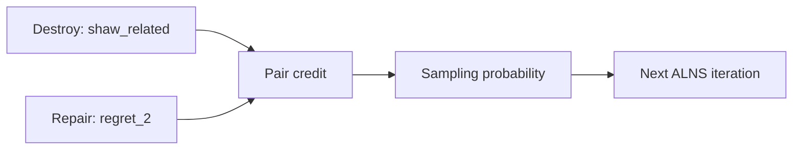

# MOSADE-Inspired Adaptive Operator Selection

This document explains the adaptive part of the project: how a strategy
selection idea from MOSADE-style evolutionary optimization is translated into
ALNS operator choice.

The claim is intentionally scoped. This is not a new exact method for VRPTW and
not a full MOSADE solver. It is an engineering adaptation of online strategy
selection: observe which search strategies work, then sample them more often.

## Why Operator Choice Looks Like Strategy Selection

In ALNS, every iteration has to choose:

```text
destroy operator: which part of the solution to remove
repair operator: how to reinsert removed customers
```

That pair controls the search behavior. In MOSADE, candidate-generation
strategies compete under feedback. The analogy is:

| Evolutionary search | ALNS in this project |
| --- | --- |
| mutation/crossover strategy | destroy/repair pair |
| trial vector quality | candidate route quality |
| selection feedback | accepted/new-best route feedback |
| adaptive strategy probability | adaptive operator-pair probability |

## Pair-Level Strategy Unit

Classical ALNS often scores destroy operators and repair operators separately.
This implementation treats the pair as the strategy:

```text
strategy = destroy_operator | repair_operator
```

Why this matters: `shaw_related_removal` may work well with `regret_2_insertion`
because both focus on neighborhood structure, while the same destroy operator
may be less useful with a different repair rule. Independent scores cannot see
that interaction.



## Reward Definition

After each iteration, the selector receives an `OperatorEvent`:

- selected destroy and repair names;
- whether the candidate was feasible;
- whether it was accepted;
- whether it produced a new best solution;
- cost change compared with the current solution.

The MOSADE-inspired selector uses:

```text
reward =
  5.0 * new_best
  + 3.0 * accepted_improvement
  + 1.0 * accepted
  + 0.2 * feasible
  + diversity_bonus
  + normalized_improvement
```

Business interpretation:

- a new best solution is the strongest signal;
- an accepted improving move is still valuable;
- a feasible candidate deserves small credit because feasibility is hard in
  VRPTW;
- a diversity bonus keeps rarely selected pairs from disappearing too early.

The reward is deliberately simple so that it can be explained and debugged.

## Memory And Probability Update

The selector stores recent pair rewards in a sliding memory. Credit is updated
by exponential smoothing:

```text
credit[pair] = decay * old_credit[pair]
               + (1 - decay) * recent_mean_reward[pair]
```

Credits become probabilities through a temperature-scaled softmax plus an
exploration floor:

```text
softmax[pair] = exp(credit[pair] / temperature) / sum(exp(...))
prob[pair] = (1 - exploration_floor) * softmax[pair]
             + exploration_floor / number_of_pairs
```

Lower temperature exploits high-credit pairs more aggressively. The exploration
floor keeps every pair reachable, which matters because route structure changes
during search.

## Comparison With Other Selectors

| Selector | What adapts | Strength | Weakness |
| --- | --- | --- | --- |
| Uniform | nothing | stable baseline | ignores feedback |
| Roulette | destroy and repair independently | simple online learning | misses pair interaction |
| MOSADE-inspired | destroy/repair pair | learns interaction | more metadata and parameters |

## Pseudocode

```text
for each ALNS iteration:
    pair = sample(pair_probabilities)
    candidate = repair(destroy(current, pair.destroy), pair.repair)
    event = evaluate(candidate, current, best)

    reward = reward_function(event, pair)
    memory.append(pair, reward)
    credit[pair] = smoothed_recent_reward(pair)
    pair_probabilities = softmax_with_exploration(credit)
```

## Logged Outputs

The selector snapshot includes:

- `pair_credit`: current smoothed credit per destroy/repair pair;
- `pair_probabilities`: current sampling probability per pair;
- `pair_heatmap`: row-style data for visualization;
- `pair_stats`: selected count, accepted count, new-best count, total reward,
  and improvement sum per pair.

These fields are saved in solution metadata and used by report figures and the
Streamlit demo.

## Interview Q&A

**Why not just tune one best operator offline?**  
The best operator can vary by instance and by search phase. Online adaptation
lets the solver respond to the route structure it is currently seeing.

**Why pair-level instead of independent destroy and repair probabilities?**  
A destroy operator creates a type of partial solution. The repair operator must
be compatible with that partial solution. The interaction is often the signal.

**How do you avoid premature convergence to one pair?**  
The exploration floor keeps every pair selectable, and the memory window allows
recent performance to override early luck.

**How would you validate that adaptation helps?**  
Run matched seeds against `alns_uniform` and `alns_roulette`, compare objective,
vehicles, distance, and runtime, then use paired statistics over instance/seed
keys. Do not claim improvement until the CSV supports it.
