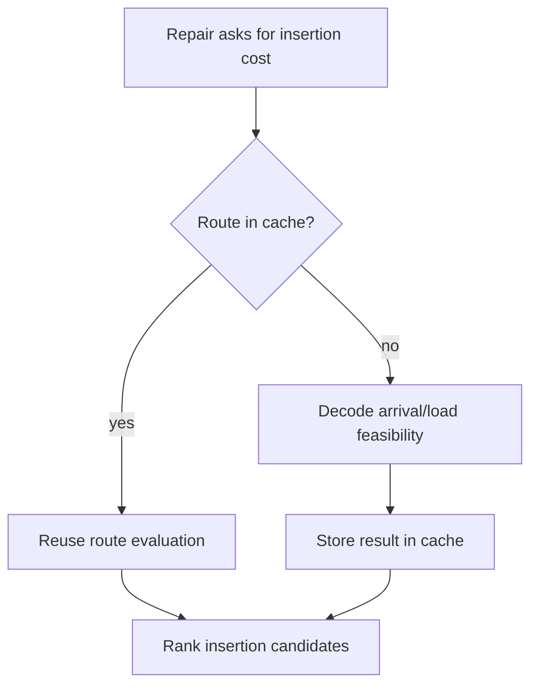

# Adaptive Large Neighborhood Search

Adaptive Large Neighborhood Search (ALNS) is the scalable heuristic layer of
the project. It starts from a feasible greedy solution, repeatedly destroys part
of the current solution, repairs it, and keeps improving solutions under a time
or iteration budget.

## Search Loop

```text
current = greedy_initial_solution(instance)
best = current

for iteration in 1..max_iterations:
    destroy = selector.select_destroy()
    repair = selector.select_repair()

    partial = destroy(current, q)
    candidate = repair(partial)
    candidate_cost = objective(candidate)

    accepted = candidate is feasible and candidate_cost < current_cost
    new_best = candidate is feasible and candidate_cost < best_cost

    selector.update(destroy, repair, accepted, new_best, delta_cost, feasible)

    if accepted:
        current = candidate
    if new_best:
        best = candidate

return best
```

The current acceptance rule is intentionally conservative: accept improving
feasible candidates. This keeps the implementation easy to reason about while
the project focuses on operator selection and validation.

## State Representation

`ALNSState` stores:

- `routes`: tuple of customer-ID tuples;
- `unassigned`: customers removed by destroy and waiting for repair;
- `cost`: objective value for the decoded route plan;
- `feasible`: whether all route and assignment constraints hold;
- `metadata`: last destroy/repair names and diagnostic fields.

This state is cheaper to mutate than a full MILP solution. It also maps directly
to the final `Solution` object used by metrics, JSON output, and maps.

## Destroy Operators

Implemented destroy operators:

- `random_removal`: removes assigned customers uniformly at random;
- `worst_distance_removal`: removes customers with large marginal distance
  contribution;
- `shaw_related_removal`: removes one seed customer and nearby/related
  customers;
- `route_removal`: removes a whole short route;
- `time_window_tight_removal`: removes customers with tight time windows.

Business interpretation: destroy operators create room for re-planning. A
distance-based destroy targets expensive arcs; a time-window destroy targets
scheduling pressure; a route removal can reduce vehicle count if repair can
reinsert those customers elsewhere.

## Repair Operators

Implemented repair operators:

- `greedy_cheapest_insertion`: cheapest feasible insertion;
- `regret_2_insertion`: prioritize customers whose second-best insertion is
  much worse than the best;
- `regret_3_insertion`: same idea with a third-best comparison;
- `time_window_priority_insertion`: insert tight-window customers earlier;
- `noise_insertion`: add light random noise to avoid deterministic tunnel
  vision.

Repair evaluates candidate insertion positions with capacity and time-window
checks. If nearest-neighbor candidate filtering finds no feasible insertion, it
falls back to the unrestricted candidate set.

## Performance Design



Two practical optimizations matter:

- route-evaluation caching avoids recalculating the same route tuple;
- nearest-neighbor route filtering narrows candidate routes before falling back
  to full search when needed.

These optimizations do not change feasibility rules or the objective. They only
change how quickly candidate moves are evaluated.

## Logged Metadata

Each ALNS solution stores:

- `history`: iteration-level cost, operator, acceptance, and selector snapshot;
- `selector`: final selector probabilities/credits;
- `profiler`: route cache and repair counters;
- `iterations`, `best_iteration`, `seed`, and `ablation`.

This metadata powers convergence plots, operator probability plots, and
Streamlit diagnostics.

## Interview Q&A

**Why ALNS instead of a simple local search?**  
VRPTW moves are constrained by time windows and capacity. Large destroy/repair
neighborhoods can escape local patterns that small swaps or 2-opt moves may not
fix.

**Why begin with greedy insertion?**  
ALNS needs a complete feasible plan to improve. Greedy insertion gives a fast,
deterministic baseline and also works as a fallback demo solver.

**What makes the implementation adaptive?**  
The solver records each operator outcome and lets a selector update future
operator probabilities from that feedback.

**What is the main engineering risk?**  
Repair can dominate runtime because it evaluates many insertion positions. That
is why candidate filtering, route cache counters, and profiler metadata are
included.
