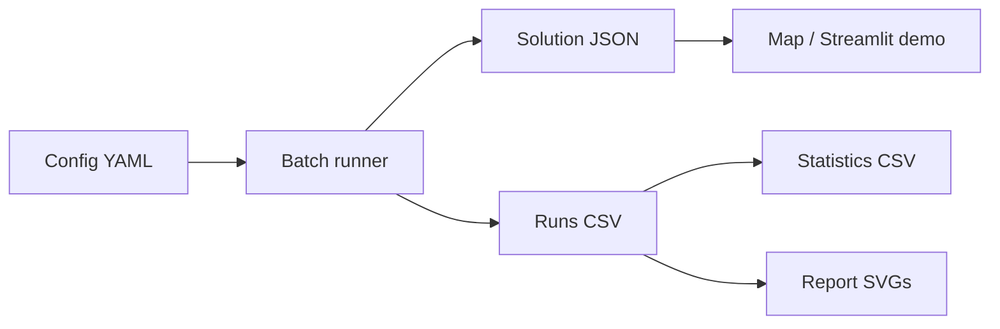

# Experiment Protocol

This document describes how to run solver comparisons without turning the
project into a collection of one-off demos. It is written for reproducibility:
same instances, same seed budget, same metrics, same output layout.

## Pipeline



The batch runner is `vrptw_hybrid.experiments.runner.run_batch`, exposed through
the CLI command:

```text
vrptw batch --config configs/solomon_small.yaml --output data/results/solomon_small
```

## Controlled Variables

Each experiment should explicitly set:

- instance paths and optional customer limits;
- solver names and ALNS selector variants;
- seed list;
- time limit;
- maximum ALNS iterations;
- objective vehicle weight;
- ablation name.

The config file is the source of truth. Avoid changing solver parameters in an
interactive notebook and then reporting the result as if it came from the batch
protocol.

## Recommended Solver Set

Start with:

- `greedy`: construction baseline and feasibility smoke test;
- `ortools_routing`: external operations-research baseline;
- `alns_uniform`: ALNS without adaptive feedback;
- `alns_mosade`: pair-level adaptive selector.

Add `alns_roulette` when the question is specifically about independent
operator scoring versus pair-level scoring.

## Metrics

Primary metrics:

- `feasible`;
- `vehicles_used` / `vehicles`;
- `total_distance` / `distance`;
- `objective` / `cost`;
- `runtime_sec`.

Secondary diagnostics:

- `iterations`;
- `best_iteration`;
- selector name;
- BKS vehicle/distance gap fields when a verified BKS entry exists;
- solution JSON path for convergence and operator metadata.

## Statistical Comparison

The statistics module compares matched `(instance, seed)` pairs. This avoids
comparing unrelated random runs.

```text
for each solver pair:
    align rows by instance and seed
    compute metric differences
    run Wilcoxon signed-rank approximation
    apply Holm correction across pairwise tests
    report rank-biserial effect size
```

Interpretation rule: a p-value is not a global proof. It is evidence that one
solver is consistently better on the chosen benchmark slice and seed budget.

## Figure Generation

Report figures are generated from result CSV files and solution JSON metadata:

- convergence curves from ALNS `history`;
- cost/runtime scatter from `runs_*.csv`;
- gap boxplots when BKS fields exist;
- operator probabilities from selector snapshots;
- pair heatmaps from MOSADE-inspired selector metadata.

If a figure is blank, first check whether the selected solver actually logs the
metadata. Greedy and OR-Tools runs do not have ALNS convergence history.

## Result Claim Policy

Do not write claims such as "distance reduced by 12%" until:

1. the relevant `runs_*.csv` exists;
2. failed or infeasible runs are visible in the summary;
3. the comparison is matched by instance and seed;
4. the same objective and time budget were used;
5. the README or resume points to the evidence file.

Before that, use `TODO`.

## Interview Q&A

**Why matched seeds?**  
Matched seeds reduce noise. Every solver faces the same instance/seed slice, so
paired differences are more meaningful than independent averages.

**Why report both vehicle count and distance if objective combines them?**  
The objective is convenient for optimization, but operations teams care about
both fixed fleet usage and variable travel cost.

**Why keep failed runs in the CSV?**  
Hiding failures makes a solver look better than it is. The summary reports
failed-run counts and feasible rate before pairwise metric tests exclude invalid
rows.

**Why generate solution JSON for every run?**  
Metrics alone are not enough. The JSON keeps route details, convergence history,
selector snapshots, and map-ready solution data for inspection.
