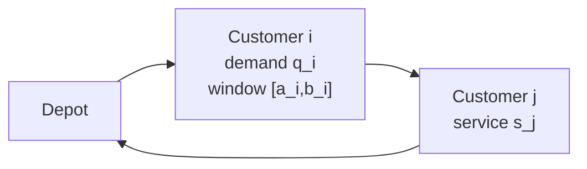

# VRPTW Modeling Notes

This document explains the mathematical model behind the code in business
terms. The goal is not to maximize formula density; the goal is to make every
constraint explainable in an interview.

## Business Object

A depot owns a fixed fleet. Each customer has demand, a service time, and a time
window. A route is feasible only if a vehicle can leave the depot, visit its
assigned customers in order, respect capacity, wait when it arrives early, and
return to the depot.



## Sets And Parameters

- `V = {0, 1, ..., n}`: depot `0` plus customers.
- `K`: available vehicles.
- `q_i`: demand of customer `i`.
- `Q`: vehicle capacity.
- `d_ij`: travel distance from node `i` to node `j`.
- `t_ij`: travel time from node `i` to node `j`.
- `[a_i, b_i]`: time window for service start at node `i`.
- `s_i`: service time at node `i`.

The implementation stores distances and times in `VRPTWInstance.distance_matrix`
and `VRPTWInstance.time_matrix`.

## Decision Variables

A classical exact model uses:

- `x_ijk in {0,1}`: vehicle `k` travels directly from `i` to `j`.
- `T_ik >= 0`: service start time for node `i` on vehicle `k`.
- `L_ik >= 0`: load after serving node `i` on vehicle `k`.
- `y_k in {0,1}`: vehicle `k` is used.

The heuristic code does not keep these variables explicitly. It stores each
route as an ordered tuple of customer IDs, then evaluates the implied arrival
times and loads.

## Objective

The project uses a hierarchical practical objective:

```text
minimize vehicle_weight * vehicles_used + total_distance
```

`vehicle_weight` is intentionally large. This mirrors many benchmark protocols:
using one fewer vehicle is more important than a small distance improvement.

Business interpretation: a fleet route plan with fewer active trucks usually
means fewer drivers, vehicles, fixed dispatch costs, and operational handoffs.

## Core Constraints

Each customer must be visited exactly once:

```text
sum_k sum_i x_ijk = 1, for every customer j
```

Vehicle flow must be continuous:

```text
sum_i x_ihk = sum_j x_hjk, for every vehicle k and visited customer h
```

Capacity must not be exceeded:

```text
L_jk >= L_ik + q_j - M * (1 - x_ijk)
0 <= L_ik <= Q
```

Time windows must be respected:

```text
T_jk >= T_ik + s_i + t_ij - M * (1 - x_ijk)
a_i <= T_ik <= b_i
```

Depot usage links to vehicle activation:

```text
sum_j x_0jk = y_k
sum_i x_i0k = y_k
```

In the route evaluator, these constraints become direct checks:

```text
arrival = previous_departure + travel_time
start_service = max(arrival, ready_time)
departure = start_service + service_time
load_after += demand

route is infeasible if:
  start_service > due_time
  load_after > vehicle_capacity
```

## Exact Vs Heuristic Model

The CP-SAT model is useful for small instances because it gives a correctness
anchor: if greedy or ALNS produces a suspicious solution on a tiny case, exact
validation helps debug the objective and constraints.

For larger instances, exact search grows too quickly. The ALNS route state is a
more compact engineering representation: it cannot prove optimality, but it can
move through large neighborhoods and keep feasible route plans improving under a
fixed time budget.

## Interview Q&A

**Why is waiting allowed?**  
If a vehicle arrives before `a_i`, it waits and starts service at `a_i`. Waiting
is common in delivery planning and can make an otherwise early route feasible.

**Why prioritize vehicle count before distance?**  
Fleet activation has fixed costs. In Solomon-style reporting, vehicle count is
often the primary objective and distance is the secondary objective.

**How do you know a heuristic route is feasible?**  
Every candidate route is decoded into arrival time, service start, departure,
and load. The checker validates capacity, time windows, depot return, duplicate
customers, and missing customers.

**Why keep both distance and time matrices?**  
Solomon fixtures use Euclidean distance as time for simplicity. City instances
can use road-network distance and travel time separately.
